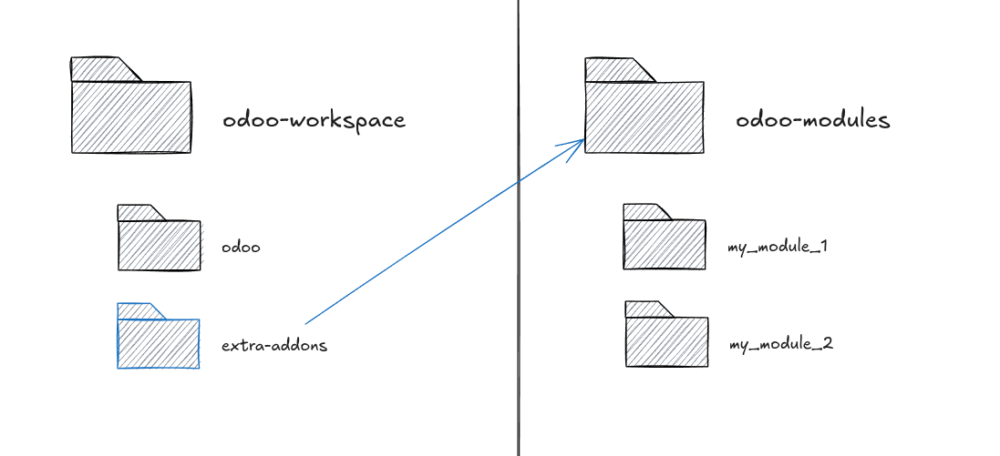

# odoo-workspace #

## About ##

A repository for setting up a local installation of [Odoo](https://www.odoo.com/).

This setup aims to simplify setting up a local instance of Odoo. It consists on having a folder containing the workspace plus another containing all installable modules.



Modules could be managed locally or added through a symbolic link to a external folder (preferred).

## Features ##

 - Local private environment managed through `pyenv`.
 - Docker Compose setup, including PostgreSQL and Adminer.
 - Easy IDE integration.

## Requirements ##

 - `git`
 - `make`
 - `pyenv`
 - Docker + Compose Plugin

## Setup ##

### Get the repo  ###

Clone this repo. Specify the branch name corresponding to the Odoo version you plan on working:

```
 git clone -b 18.0 https://github.com/emaphp/odoo-workspace.git my-odoo-project
```

You might want to override `origin` to point to your own repo:

```
 cd my-odoo-project
 git remote set-url origin <REPO_SSH_URL>
```

### Getting Odoo  ###

Getting Odoo codebase can be achieved by adding it as a Git submodule or by simply downloading it as an archive. Each method has it owns pros and cons.

#### Method 1: Adding Odoo as a submodule  ####

To add Odoo as a submodule you can enter the following Git command:

```
 git submodule add -b 18.0 https://github.com/odoo/odoo.git odoo
```

This could take some time as it needs to get the entire branch along its history. You can achieve the same by doing `make fetch`. To get the latest changes from upstream you can do `git submodule update --remote` or `make update`.

#### Method 2: Get a copy as a ZIP  ####

Run the following command. This will get Odoo from the branch specified in `ODOO_BRANCH`:

```
 make download
```

You extracted copy of Odoo is now stored in `odoo/`. You might want to add the `odoo` folder to your `.gitignore`.

### Virtual environment ###

Proceed to create the virtual ennironment by running `make setup`. This will create a new virtual environment named `odoo_v18`, which you can find in `~/.pyenv/versions/odoo_v18`. If you already have a virtual environment set up for this version of Odoo then you might want to set the local Python version (`pyenv local 3.10.18`).

To activate the virtual environment run `pyenv activate odoo_v18`.

If this fails, check that your `~/.profile` includes the following lines:

```
export PYENV_ROOT="$HOME/.pyenv"
[[ -d $PYENV_ROOT/bin ]] && export PATH="$PYENV_ROOT/bin:$PATH"
eval "$(pyenv init - bash)"
eval "$(pyenv virtualenv-init -)"
```

Reload the file (`source ~/.profile`) and try again.

### Install dependencies ###

Install the environment dependencies by doing `make install`. This will install all packages included in `requirements.txt`.

**Note***: the list of dependencies has been modified to avoid certain installation issues with a particular set of packages (specifically `gevent` and `greenlet`).

Additionally, if your setup defines an external *addons* folder (like the one in the image) you can create a *symlink* to it by hand (`ln -s /path/to/addons extra-addons`) or by running `make symlink`. This target assumes you have a `odoo-v18-modules` folder located at the same parent directory.

## Configuration ##

The repository already includes an `odoo.conf` file. Adjust the value pointing to the addons folder (`addons_path`). Then, either copy this file to the `odoo` folder (`cp odoo.conf odoo/`) or create a symbolic link to it (`ln -s $(pwd)/odoo.conf odoo/odoo.conf`).

## Docker ##

A Docker Compose file is already included with this repository. This file reads the environment variables from `.env`. You can create one using the template:

```
 cp env-example .env
```

Containers are connected through an external network (`odoo_workspace`). Run `make network` to create it. Once done, start both containers by doing `docker compose up -d`. This will run `postgres` at `5432` and `adminer` at `8081`. The database port IS EXPOSED.

In order to access the database from Adminer, navigate to http://localhost:8081 and put the following values:

 - Engine: PostgreSQL
 - Host: postgres
 - User: odoo
 - Password: pgsecret

## IDE Integration ##

### PyCharm ###

Open the workspace folder and go to *Settings*. Add a new *Interpreter* amd select the option *Add Local Interpreter*. Click the option *Select Existing* and then pick the one installed as `odoo_v18` (`~/.pyenv/versions/odoo_v18/bin/python3.10`) by clicking on the directory icon. Verify that the list of packages is correct. It should list all dependencies available in `requirements.txt`. Click *Apply* and then *Ok*.

Add a new *Run Configuration*. Make sure it uses the same interpreter declared in the previous step. Select the `script` option from the list and set the executable path to `$WORKPACE_DIR/odoo/odoo-bin`. Set the following flags: `-c odoo.conf -i base`. Set the *Working Directory* as the one including the `odoo` repository (`$WORKPACE_DIR/odoo`).

Apply changes and run.

## Additional targets ##

### up ###

Runs `docker compose up -d`

### down ###

Runs `docker compose down`

### shell ###

Starts a new Odoo Shell session.

### purge ###

Closes all running containers and deletes the database volume. **Warning**: This will DELETE all data from your Odoo instance.

## Extras ##

Looking for a fully dockerized environment? Check [this repo](https://github.com/emaphp/odoo-starter-docker) instead.

## License ##

Released under MIT.
